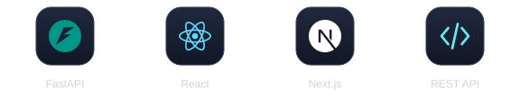
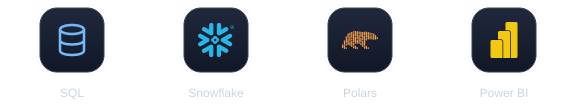

<!-- Banner -->


<div align="center">


<br/>

<a href="https://www.linkedin.com/in/caio-rodrigues45"></a>
<a href="mailto:tglcaiohenrique@gmail.com"></a>
<a href="https://github.com/caioroodrigues"></a>

</div>

---

## 🧠 Sobre mim

Sou desenvolvedor focado em **automação, dados e desenvolvimento de soluções**, com interesse crescente em **cibersegurança**.

Gosto de pegar um problema real, encontrar onde está o gargalo e transformar processos manuais em soluções mais rápidas, inteligentes e confiáveis.

- 🔭 Construindo automações e projetos orientados a dados
- 🌱 Aprofundando em **backend** e **cibersegurança** (labs e CTFs)
- 🤖 Explorando aplicações práticas de **IA** no dia a dia de desenvolvimento
- 💬 Pode me chamar para falar sobre **Python, SQL, automação e dados**

---

## 🚀 Tech Stack

<div align="center">

**💻 Linguagens**


**⚙️ Backend**



**📊 Dados**



**🤖 Inteligência Artificial**


**🔁 Automação**


**🔐 Cibersegurança**


**☁️ Infra & Ferramentas**


</div>

---

## 🔥 No que estou trabalhando

| Área | Foco |
|---|---|
| ⚙️ **Automação** | Scripts, integrações e bots que eliminam trabalho manual repetitivo |
| 📊 **Dados** | SQL, tratamento de grandes volumes e análises que viram decisão |
| 🌐 **Desenvolvimento** | APIs e aplicações web com tecnologias modernas de backend |
| 🔐 **Cybersecurity** | Redes, sistemas e boas práticas, aprendendo com labs e projetos |
| 🤖 **IA + Automação** | Uso prático de IA em programação, análise e produtividade |

---

## 📊 GitHub Stats

<div align="center">


</div>

---

## 💭 Como eu penso

```python
while True:
    problem = find_problem()
    solution = build(problem)
    automate(solution)
    learn()
    improve()
```

---

<div align="center">

### ⚡ Build. Automate. Learn. Repeat.


</div>
