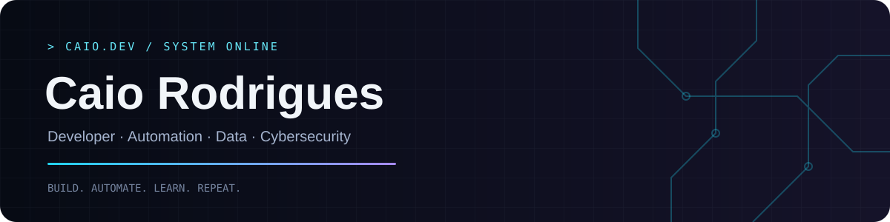

<!-- Envie também a pasta assets para a raiz do repositório. -->
<p align="center">
  
</p>

<p align="center">
  <a href="https://www.linkedin.com/in/caio-rodrigues45">LinkedIn</a> ·
  <a href="mailto:tglcaiohenrique@gmail.com">E-mail</a> ·
  <a href="https://github.com/caioroodrigues">GitHub</a>
</p>

## 🧠 Sobre mim

Sou desenvolvedor focado em **automação, dados e desenvolvimento de soluções**, com interesse crescente em **cibersegurança**.

Gosto de entender problemas reais, identificar gargalos e transformar processos manuais em soluções mais rápidas, inteligentes e confiáveis.

- 🔭 Construindo automações e projetos orientados a dados.
- 🌱 Aprofundando conhecimentos em **backend e cibersegurança**, com labs e CTFs.
- 🤖 Explorando aplicações práticas de **IA** no desenvolvimento.
- 💬 Vamos conversar sobre **Python, SQL, automação e dados**.

---

## 🚀 Tech Stack

### 💻 Linguagens

<p align="center">
  
</p>

### ⚙️ Backend

<p align="center">
  
</p>

### 📊 Dados

<p align="center">
  
</p>

### 🤖 Inteligência Artificial

<p align="center">
  
</p>

### 🔁 Automação

<p align="center">
  
</p>

### 🔐 Cibersegurança

<p align="center">
  
</p>

### ☁️ Infra & Ferramentas

<p align="center">
  
</p>

---

## 🔥 No que estou trabalhando

| Área | Foco |
| --- | --- |
| ⚙️ **Automação** | Scripts, integrações e bots que eliminam tarefas repetitivas |
| 📊 **Dados** | SQL, tratamento de dados e análises para apoiar decisões |
| 🌐 **Desenvolvimento** | APIs e aplicações com tecnologias modernas de backend |
| 🔐 **Cibersegurança** | Redes, sistemas e boas práticas em labs e projetos |
| 🤖 **IA + Automação** | IA aplicada à programação, análise e produtividade |

---

## 📊 GitHub Stats

<!-- Estes cards dependem de serviços externos e podem ficar indisponíveis. -->
<p align="center">
  
  
</p>

---

## 💭 Como eu penso

```python
while True:
    problem = find_problem()
    solution = build(problem)
    automate(solution)
    learn()
    improve()
```

<p align="center"><strong>⚡ Build. Automate. Learn. Repeat.</strong></p>
