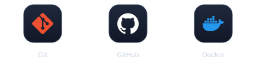

# 👨‍💻 Caio Rodrigues

<p align="center">
  
</p>
<p align="center">
  <a href="https://www.linkedin.com/in/caio-rodrigues45"></a>
  <a href="mailto:tglcaiohenrique@gmail.com"></a>
  <a href="https://github.com/caioroodrigues"></a>
</p>
<p align="center">
  
</p>

---

## 🧑‍💻 Sobre mim

Sou um profissional interessado em tecnologia, automação e desenvolvimento de soluções que resolvem problemas reais.

Gosto de entender processos, identificar tarefas repetitivas e transformar atividades manuais em fluxos mais eficientes, utilizando programação, dados e inteligência artificial.

Atualmente, direciono meus estudos e projetos para:

- ⚙️ **Automação:** desenvolvimento de scripts e otimização de processos operacionais.
- 🐍 **Python:** processamento de dados, lógica de programação e construção de soluções.
- 🗄️ **Banco de dados:** consultas SQL, extração e organização de informações.
- 🤖 **Inteligência artificial:** integração de modelos de IA em ferramentas e fluxos de trabalho.
- 🌐 **Desenvolvimento web:** construção de aplicações e APIs.
- 🔐 **Cibersegurança:** aprofundamento em segurança da informação e infraestrutura.

Acredito que tecnologia vai além de escrever código: o objetivo é construir soluções úteis, reduzir trabalho manual e gerar resultados mensuráveis.

---

## 🚀 Tech Stack

### 💻 Linguagens

<p align="center">
  
</p>

### ⚙️ Backend & Desenvolvimento Web

<p align="center">
  
</p>

### 📊 Dados & Banco de Dados

<p align="center">
  
</p>

### 🤖 Automação & Inteligência Artificial

<p align="center">
  
</p>

### 🛠️ Ferramentas

<p align="center">
  
</p>

---

## 🧪 No que estou trabalhando

- **Automação de processos:** redução de tarefas repetitivas e melhoria de fluxos operacionais.
- **Inteligência de dados:** extração, tratamento, cruzamento e análise de informações para apoiar decisões.
- **Aplicações web:** desenvolvimento de interfaces, APIs e integração entre sistemas.
- **IA aplicada:** exploração de formas de utilizar modelos de linguagem para ampliar a produtividade.
- **Cibersegurança:** evolução contínua dos conhecimentos em segurança e tecnologia.

---

## 📈 GitHub Stats

<p align="center">
  
</p>
<p align="center">
  
</p>
<p align="center">
  
</p>

---

## 💡 Minha filosofia

```python
while True:
    problem = identify_problem()
    solution = build_solution(problem)
    automate(solution)
    learn()
    improve()
```

<p align="center"><strong>Build. Automate. Learn. Repeat.</strong></p>
<p align="center">
  <a href="https://github.com/caioroodrigues?tab=repositories"></a>
</p>
